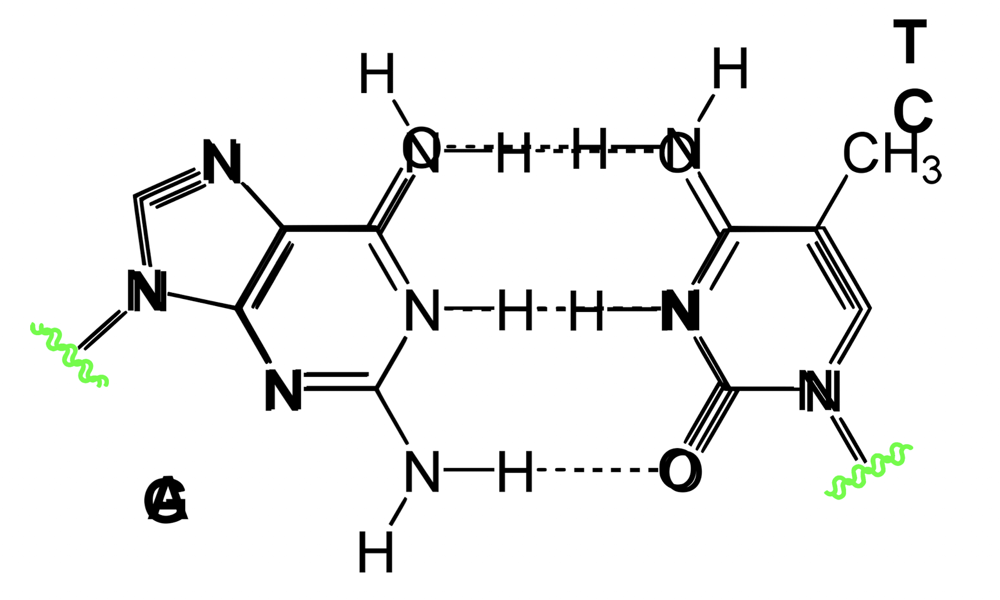
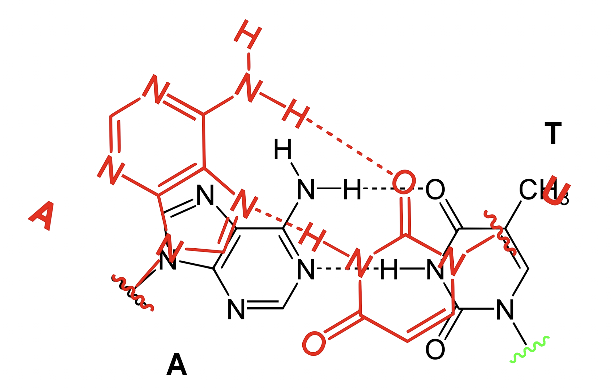
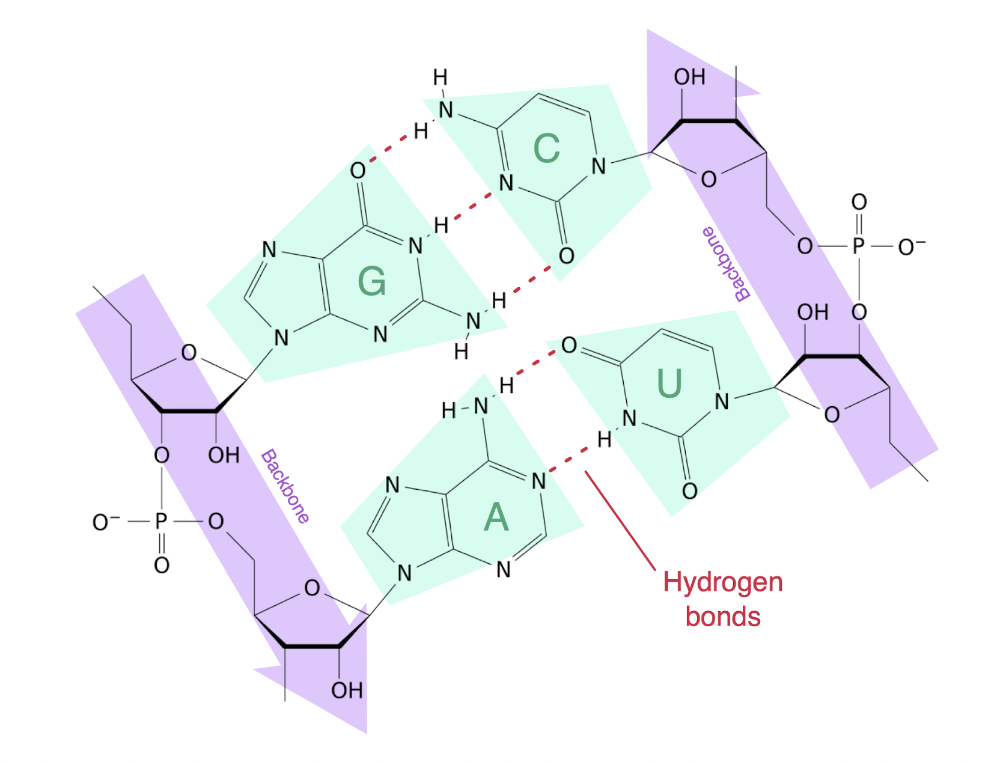
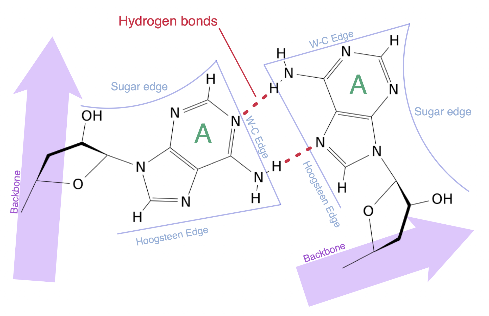
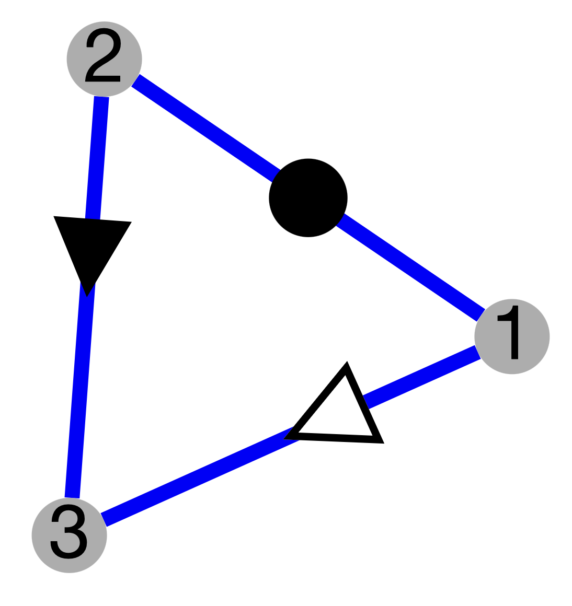
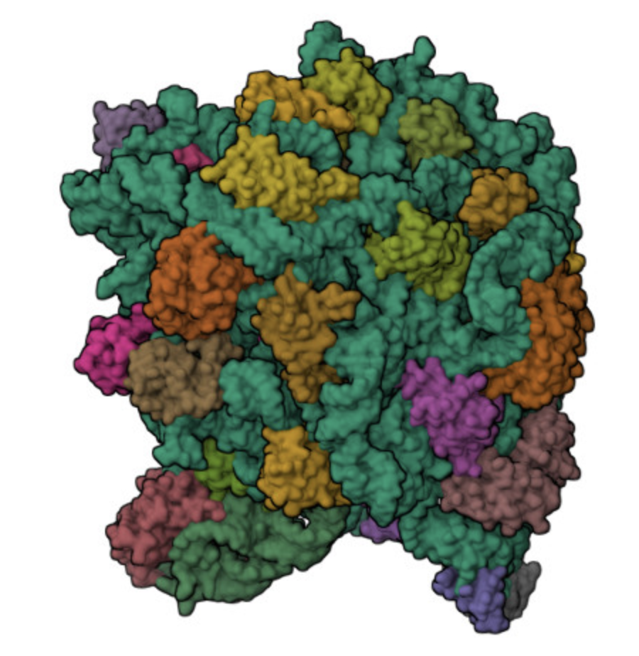
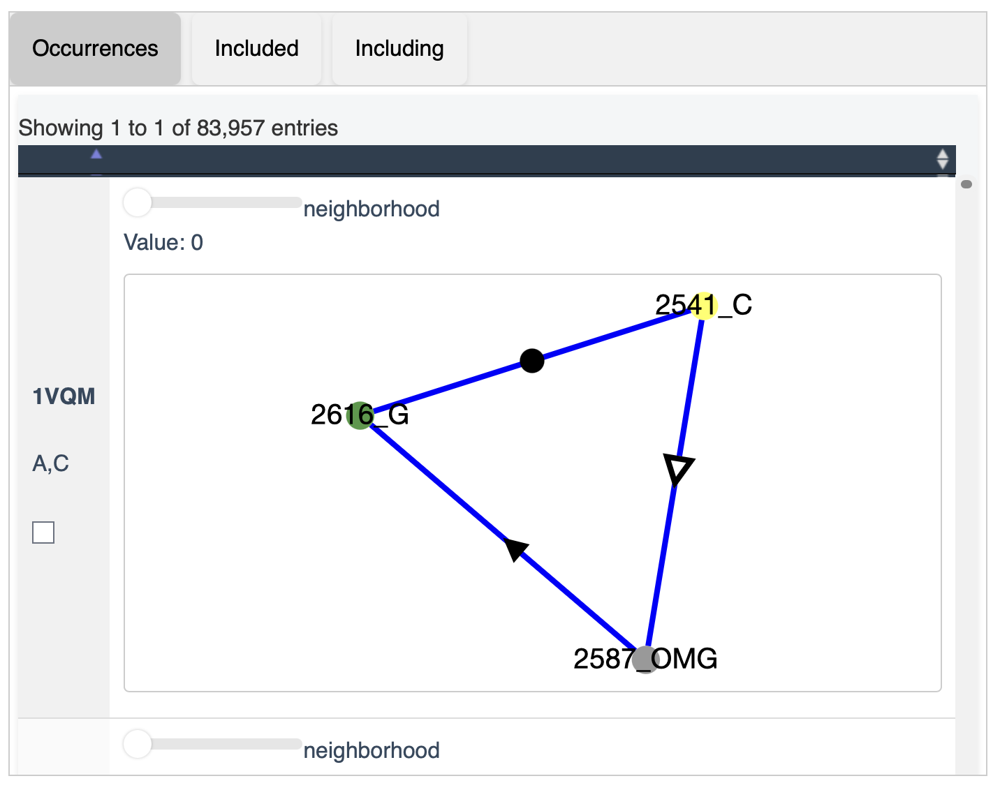
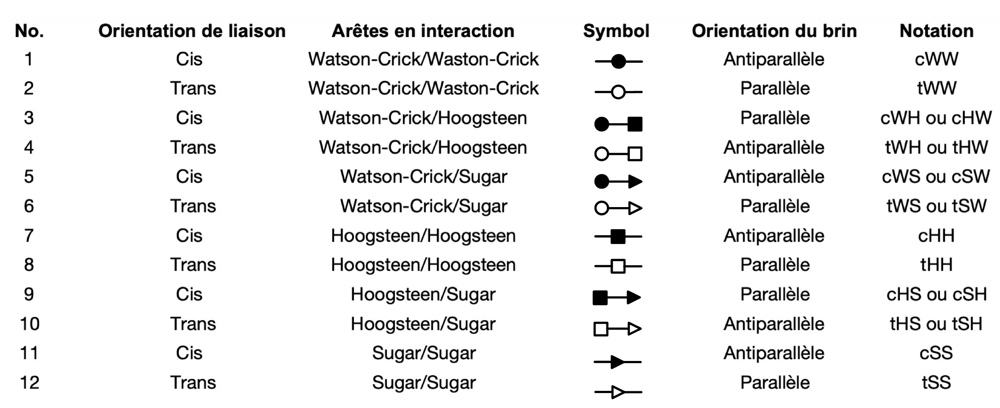

<style type="text/css">

.tocify-header {
  text-indent: initial;
}

.tocify-subheader > .tocify-item {
  text-indent: initial;
  padding-left: 2em;
}

#TOC{
  padding:5px;
#  transform: translateY(50%);
}


body{ /* Normal  */
    font-size: 16px;
     color: black;
}

h1.title {
  font-size: 36px;
  text-align: center;
}

h4.subtitle {
  text-align: center;
  color: black;
}

h4.author {
  text-align: center;
  color: black;
}

h4.date {
  text-align: center;
   color: black;
}
  
h1 { /* Header 1 */
  font-size: 24px;
}

h2 { /* Header 2 */
    font-size: 20px;
}

h3 { /* Header 3 */
  font-size: 18px;
}

</style>

# Introduction
Chacun des molécules biologiques ADN, ARN et protéines interviennent dans la transmission de l'information génétique et sont indispensable à tout être vivant. La modélisation structurelle de l'ADN, de l'ARN et des protéines nous permet de comprendre leur fonction, ce qui a des implications dans de nombreux domaines, tels que l'agriculture et la médecine. [@molecularBiology]

La réussite de la modélisation structurelle informatique dépend sur des données nombreuses et équilibrées, ainsi que sur des annotations de qualité. Bien que des progrès significatifs aient été réalisés dans la prédiction de la structure de l'ADN et des protéines, la modélisation de l'ARN demeure plus compliquée en raison du nombre limité de données disponibles et de ses propriétés structurelles, telles que ses motifs. [@RNAFunctionFollowsForm] 

Nous présenterons les raisons pour lesquelles la complexité de la structure de l'ARN rend sa prédiction difficile, ainsi que les différents outils existants pour l'identifier et la prédire.

# ADN et protéines

Les structures d'ADN et de protéines sont généralement plus faciles à prédire que celles de l'ARN puisqu'elles présentent des structures beaucoup plus consistantes et rigides. En effet, l'ADN présente une structure uniforme de double hélice très prévisible qui consistent d'une série répétitive de paires de bases nucléotidiques suivant des règles d'appariement Watson-Crick (A-T, C-G). Elle suit des règles de géométrie simples qui rendent sa structure stable à l'aide d'interactions hydrophobes et de Van der Waals. De ce fait, la stabilité de la structure de l'ADN permet la conservation de l'information génétique. Ses propriétés de superposition, donc l’empilement des bases azotées les unes sur les autres au centre de la double hélice (Figure \@ref(fig:geometryOfDNAAndRNA) (gauche)), facilitent grandement la modélisation. [@dna]

```{r geometryOfDNAAndRNA, fig.align="center", fig.show="hold", fig.cap="(gauche) Géométrie de l'ADN [@DNAGeometry]; (droite) Géométrie de l'ARN [@RNAGeometry]", echo=FALSE, out.width='50%'}


```

Les structures de protéines, quant à eux, bénéficient d'un large éventail de données disponibles. La Protein Data Bank (PDB) contient plus de 200 000 structures de protéines annotées, alors qu'il en existe seulement 10 000 pour les structures de l'ARN. Le repliement des protéines est plus prévisible que celui de l'ARN, se basant sur la séquence primaire de la chaîne d'acides aminés. De plus, les protéines contiennent de l'information évolutif, aidant fortement les algorithmes de prédiction à inférer les séquences d'acides aminés en utilisant des alignements de séquences multiples. [@protein] Les ARNs sont moins annotés que les protéines, surtout puisqu'il est chimiquement plus difficile d'entreprendre des expériences de cristallographie pour définir leurs structures. [@RNAFunctionFollowsForm]

# ARN
## L'importance de l'ARN
Jusqu'aux années 1980, l'ARN était largement considéré comme un simple intermédiaire entre l'ADN et les protéines. Puisque plus de 95 % du génome ne code pas pour des protéines, ces régions produisant des ARN non codants (ARNnc) étaient souvent considérées comme *junk DNA* - ou de «l'ADN indésirable ». Cependant, cette perspective a maintenant changé. Nous savons aujourd’hui que les ARNnc sont essentiels et jouent des rôles dans la régulation de l’expression des gènes, le remodelage de la chromatine et divers processus cellulaires.

L'ARN est aussi impliqué dans plusieurs maladies. La dérégulation des ARNnc a été associée au cancer, aux troubles neurologiques et aux infections virales telles que la COVID-19. L'amélioration de nos connaissances sur l'ARN peut nous aider à mieux comprendre ces maladies. 

Les approches basées sur l'ARN sont appliquées dans plusieurs domaines, par exemple, dans l’agriculture, l’interférence par l’ARN est utilisée pour développer des traits souhaitables, tels que des noix et des arachides non allergènes; en médecine, les vaccins à ARNm ont été développés en réponse à la pandémie de COVID-19. [@RNAIsImportant]

En déterminant la structure de l'ARN, on peut mieux comprendre la fonction de cette molécule essentielle.


## Structure d'ARN
La modélisation de l’ARN est difficile, notamment à cause de sa structure. RNA has a more flexible backbone than proteins, which makes its structure more dynamic and can change shape while performing biological tasks. Elle présente une seule chaîne de nucléotides, donc nous perdons les propriétés de superposition (Figure \@ref(fig:geometryOfDNAAndRNA) (droite)) offertes par l’ADN (plus possible d’avoir une structure constante de double hélice parfaite). Cette chaîne de nucléotides permet aux interactions d'appariement de bases de se produire entre les nucléotides d'un même brin. Les motifs structurels, comme les hélices et les boucles, sont des éléments de structure secondaire assemblés à partir de paires de bases Watson-Crick (A-U et C-G) (Figure \@ref(fig:basePairs) (gauche)) et de paires de bases wobble (G-U). [@RNAStructures2] 

```{r basePairs, fig.align="center", fig.show="hold", fig.cap="(gauche) Paires de bases Watson-Crick d'ARN [@RNACanonical]; (droite) Example d'une paire de base non-Watson-Crick, W-C/Hoogsteen  [@RNANonCanonical]", echo=FALSE, out.width='40%'}


```

Bien que l’appariement des bases soit souvent considéré en termes de paires Watson-Crick, d’autres appariements sont également possibles. [@RNAMotifs] Les paires de bases non-Watson-Crick impliquent différentes interactions nucléotidiques de l’appariement Watson-Crick. Les éléments structuraux secondaires s'assemblent principalement à l'aide de paires de bases non-Watson-Crick (Figure \@ref(fig:basePairs) (droite)) pour former des structures tertiaires, tels que des kink-turns ou A-mineurs.

Ces structures, appelées modules d’ARN, sont caractérisées par des ensembles de paires de bases non-Watson-Crick orientées et ordonnées. Les paires de bases non-Watson-Crick sont plus faibles que les bases Watson-Crick mais ils jouent un rôle important dans la stabilisation de la structure tertiaire de l’ARN. Les modules ont aussi d'autres rôles fonctionnels importants dans les molécules d'ARN, comme servir de sites de liaison aux protéines et à l'ARN. [@RNAStructures] 

Les modules apparaissent de façon récurrente dans différents ARN. On suppose que le même module présent dans différentes structures d'ARN a une importance fonctionnelle. [@MotifSignificance] Par example, Il y a 83 957 (trouvé sur CaRNAval (Figure \@ref(fig:module-example2))) occurrences du module représenté dans la Figure \@ref(fig:module-example) (gauche), comme par exemple dans le ribosome 1VQM (Figure \@ref(fig:module-example) (droite)).  


```{r module-example, fig.align="center", fig.show="hold", fig.cap="(gauche) Le module d'ARN, RIN-2 [@RIN-2]; (droite) Le ribosome 1VQM tirée du PDB [@1VQM]", echo=FALSE, out.width='30%'}


```

```{r module-example2, fig.align="center", fig.cap="Les occurrences du RIN-2 (A-Minor Type I) [@RIN-2]", echo=FALSE, out.width='70%'}

```
L'ARN peut également interagir entre lui (ARN-ARN) ou avec d'autres molécules (ARN-ADN, ARN-protéines), formant des structures quaternaires, comme les ribosomes ou les spliceosomes. [@RNAStructures2]

# Représentations des structures de l'ARN
Une façon de modéliser la structure secondaire de l'ARN est d'utiliser la notation Dot-Bracket du package [ViennaRNA](https://www.tbi.univie.ac.at/RNA/ViennaRNA/doc/html/index.html). Dans cette notation, les nucléotides appariés sont représentés par des *brackets* `()` - ou «parenthèses» - et non appariés par des *dots* `.` - ou «points». Par example, la notation Dot-Bracket du modèle d'ARN 3E5C ressemble à ceci : 

```
GUUCCCGAAAGGAUGGCGGAAACGCCAGAUGCCUUGUAACCGAAAGGGGGAAU 
((((((..((((.(((((....)))))....))))....((....))))))))
```

La Figure \@ref(fig:rna-3E5C) (gauche) représente une visualisation de la structure secondaire. Les parenthèses correspondent aux bases appariées (vert) et les points correspondent aux régions non appariées telles que les *multiloops* (rouge), les boucles internes (jaune) et les épingle à cheveux (bleu).


```{r rna-3E5C, fig.align="center", fig.show="hold", fig.cap="(gauche) La structure secondarie de l'ARN 3E5C dessinée en utilisant [ViennaRNA Web Services](http://rna.tbi.univie.ac.at/forna/); (droite) La structure tertiare de l'ARN 3E5C tirée du PDB [@3E5C]", echo=FALSE, out.width='40%'}
knitr::include_graphics("rna_3E5C.png")
knitr::include_graphics("rna_3E5C_3D.jpeg")
```


Cependant, l'ARN va au-delà sa structure secondaire. L'ARN est capable de former des structures tertiaires impliquant des paires de bases non-Watson-Crick, montrés par les points verts dans la Figure \@ref(fig:rna-3E5C) (droite). Ces structures tertiaires peuvent être représentées sous forme de graphes. 

Le modèle Leontis-Westhof classe les configurations géométriques des paires de bases en 12 classes (Figure \@ref(fig:Leontis-Westhof-table)). Les interactions arête à arête (par liaisons hydrogène) entre les bases de l'ARN impliquent soit l'arête Watson-Crick, soit l'arête Hoogsteen ou soit l'arête Sugar, et les bases peuvent interagir dans l'une ou l'autre de deux orientations, cis ou trans. [@Leontis-Westhof] 

```{r Leontis-Westhof-table, fig.align="center", fig.show="hold", fig.cap="La Classification Leontis-Westhof adapté du [NAKB](https://nakb.org/basics/bases.html)", echo=FALSE, out.width='100%'}

```

Dans la Figure \@ref(fig:RIN-17), par exemple, si l'on considère les noeuds 4 et 6, on observe que l'arête reliant ces deux noeuds est tSS, ce qui indique que les orientation de liaison est 
trans, l'arête en interaction est Sugar/Sugar et orientation du brin est paralèlle.


```{r RIN-17, fig.align="center", fig.show="hold", fig.cap="RIN-17 tirée du CaRNAval [@RIN-17]", echo=FALSE, out.width='30%'}
knitr::include_graphics("rin-17.png")
```


Cette représentation par des graphes de l'ARN est utilisée par differents programmes informatiques pour trouver des sous-graphes conservés dans un graphe arbitraire donné.


# Approches informatiques pour identifier et prédire l'ARN
L'identification d'un module dans une structure d'ARN fournit des informations sur la structure secondaire, qui peuvent ensuite donner des informations sur la fonction locale d'une molécule. [@RNAStructures]. Un problème fondamental est de prédire comment les séquences se replient dans un certain modèle d'énergie.

Une façon de prédire la structure secondaire de l'ARN est d'utiliser la programmation dynamique en la représentant sous forme de graphe, où les paires de bases sont décrites par des paires d'indices (i, j).(draw figure). Il existe différents algorithmes pour aborder ce problème. L'un d'eux, *Base pair maximization*, consiste à trouver la structure possédant le nombre maximal de paires de bases. This approach runs in linear time (verify) mais cette approche ne peut pas représenter les *pseudonodes* car elle viole la définition récursive du score optimal (figure). Cela pose un problème en ce qui concerne la précision de la prédiction de l'ARN parce que les *pseudonodes* sont abondants dans l'ARN et sont associés à de nombreuses fonctions, notamment le décalage du cadre de lecture ribosomal, l'autoclivage et l'auto-épissage. (https://pmc.ncbi.nlm.nih.gov/articles/PMC2248259/) D'autres algorithmes, *comme maximum weighted matching*, peuvent traiter les *pseudonodes*. Cependant, il a été prouvé que la prédiction des structures secondaires à énergie libre minimale avec *pseudonodes* est un problème NP-difficile (https://pubmed.ncbi.nlm.nih.gov/32160034/), ce qui signifie qu'il ne peut pas être résolu en temps polynomial. (https://www.molgen.mpg.de/3710236/eddy2004.pdf)

- cite, add figures, and explain why the recursive def is violated

# Approches informatiques de la représentation d'ARN

## CaRNAval
[CaRNAval](https://carnaval.cbe.uqam.ca/) est un outil crée par Vladimir Reinharz et al. qui utilise une méthodologie basée sur les graphes pour extraire tous les Réseaux Récurrents d'Interaction (RINs) provenant de bases de données des structures 3D d'ARN. Il cherche tous les patrons des paires de bases et trouve les modifications et réseaux associés. Les RINs se distinguent des modules d’interaction (ceux qui connectent deux éléments différents de structure secondaire, comme le A-minor Type I/II) par le fait qu'ils ne contiennent aucune information sur la séquence. Ils expliquent plutôt les interactions des nucléotides ainsi que leur nature. Un seul RIN peut donc être associé à plusieurs modules d'interaction.

## RNA 3D Hub  
Le RNA 3D Hub est une meta base de donnée spécialisée développée par le *BGSU RNA Structural Bioinformatics Group* à l'université Bowling Green State. Il est organisé en plusieurs outils et bases de données permettant une analyse et une compréhension assidue des structures d'ARN, englobé dans un seul endroit. Il est constitué de 4 catégories:  
  
- [RNA Structure Atlas](https://rna.bgsu.edu/rna3dhub/pdb) contient des annotations d'appariement et d'empilement de bases, ainsi que d’interactions base-squelette dans les ARN ayant des structures 3D qui contiennent des fichiers PDB. Ces annotations sont générées par l'outil FR3D (Find RNA 3D), un programme qui cherche des structures 3D géométriquement et symboliquement, lancé par Sarver et al. en 2008. [@fr3d]. Il est mis à jour hebdomadairement.  
  
- [Representative Sets](https://rna.bgsu.edu/rna3dhub/nrlist) est une liste non-redondante de structures 3D. La PDB contient plusieurs structures identiques ou très similaires pour la même molécule du même organisme. Donc, le RNA 3D Hub regroupe dans cette liste des classes d'équivalence de séquences/structures et choisit la meilleure version pour représenter le groupe. Elle est utile lorsqu'il faut entraîner des données ou faire une recherche sur la base de donnée de structures 3D d'ARN entière. 
  
- [RNA Motif Atlas](https://rna.bgsu.edu/rna3dhub/motifs) est une large collection de motifs d'épingle à cheveux, interne, de jonctions et de boucles multi-hélice extraits des Representative Sets des structures 3D d'ARN en utilisant FR3D à nouveau. Des groupes de motifs similaires en termes de géométrie et d’interactions d'appariement de bases sont crées par regroupement hiérarchique. Ces derniers sont définis par des identifiants uniques et stables.[@atlas]  
  
- [Resources]() contient divers autres outils, dont WebFR3D, JAR3D et R3D.

## BayesPairing2
[BayesPairing2](https://jwgitlab.cs.mcgill.ca/sarrazin/rnabayespairing2) est un algorithme conçu par Roman Gendron Sarazin et al.. Cet outil assure une recherche assidue de modules de ARNs dans des séquences. Il remplace son prédécesseur, BayesPairing 1, en assurant une meilleure précision et flexibilité. Cet outil permet l'analyse des structures d'une séquence d'ARN donnée à l'aide d’échantillonnage stochastique de structures secondaires. Il utilise cette information pour ensuite identifier des sites d’insertion de modules potentiels et sélectionner des modules qui peuvent se présenter dans ce contexte structural. De sorte. cela lui permet de réduire le nombre de faux positifs et de rechercher plusieurs modules à la fois. Il peut également entreprendre des recherches à partir d'alignements de séquences.   
  
Pour les paires de bases canoniques, à l'équilibre thermodynamique, il est attendu qu'une séquence d'ARN ait un comportement stochastique et qu'elle puisse adopter quelconques de ses structures secondaires compatibles avec elle-même en respectant les règles canoniques d'appariement de bases Watson-Crick/Wobble avec une probabilité proportionnelle à son facteur de Boltzmann. Ce dernier détermine la probabilité d'un système physique occupant un état d'énergie spécifique à une température donnée.  
  
Puisqu'il n'y a présentement pas de données thermodynamiques associées aux paires de bases non-canoniques et leurs modules, BayesPairing2 utilise une approche probabiliste pour leur modélisation. Il génère un réseau bayésien pour chaque module et les séquences qui peuvent le contenir. Les structures de ces réseaux sont dérivées de paires de bases contenues dans des motifs 3D récurrents et sont regroupées géométriquement. Les réseaux subissent ensuite une décomposition arborescente de sorte à minimiser les dépendances des différentes positions du module entre elles, tout en préservant les probabilités d'émission. Puis, à l'aide de pseudo-comptes, les probabilités d'émission conditionnelles de maximum de vraisemblance sont identifiées pour chaque module. [@stochastic]  
  
# Utilisation de BayesPairing2  
  
Pour tester les outils et comprendre leurs différences, nous avons décidé de comparer les différentes bases de données comprises dans Bayespairing2. Nous avons essayé d'utiliser celle de cantaloops_carnaval_v5, mais elle générait à chaque reprise l'erreur *IndexError: list index out of range*. Donc, pour notre expérience, nous allons comparer les différents résultats que peuvent émettre les bases de données intégrées dans l'outil. Celles-ci comprennent:  
  
- RELIABLE: Un sous-ensemble de 60 modules provenant du [RNA 3D Motif Atlas]() avec le plus grand nombre d'occurrences et la plus grande variation de séquence.   
  
- rna3dmotif: Un ensemble de données des 75 modules les plus récurrents dans la PDB. Recherche entreprise avec [rna3dmotif]().  
  
- ALL: Un ensemble de tous les modules qui ont pu être convertis des modèles de 3D  Motif Atlas à ceux de BayesPairing2 (426 au total)    
   
- tdma388_KT: Un ensemble spécialisé des modules ayant un motif Kink-Turn. Utile lorsque nous voulons identifier spécifiquement ce motif. Pour notre expérience, nous avons employé uniquement les trois derniers ensembles mentionnés ci haut.    

Puisque nous avons uniquement identifié les séquences de nucléotides, BayesPairing2 a entrepris un échantillonnage non redondant des structures secondaires de l'ensemble complet en utilisant RNAsubopt. La librairie htd entreprend la décomposition arborescente des modules et les probabilités conditionnelles sont apprises à l'aide de pgmpy. [@bayes]  

Les scores des modules représentent un ratio de rapport de vraisemblance reflétant la probabilité de la séquence dépendamment du module. Un score élevé indique une très grande similarité à un motif 3D connu dans l'ensemble de donnée utilisé. Nous avons ensuite identifié les motifs visuellement (normalement il est possible de mapper les modules à leurs motifs, mais nous avons rencontré un problème avec certains scripts que ne n'avons malheureusement pas pu troubleshoot). Nous les avons aussi validés en rentrant les séquences sur [JAR3D](), un autre outil qui peut identifier des motifs dans des séquences d'ARN.

## Jeux de données et résultats  
Trois séquences ont été choisies via PDB.  
  
*GUAA tetraloop mutant of Sarcin/Ricin domain from E. Coli 23 S rRNA* ([PDB 1MSY](https://www.rcsb.org/structure/1MSY))  
`>1MSY_1|Chain A|SARCIN/RICIN DOMAIN FROM 23 S RRNA|null`  
`UGCUCCUAGUACGUAAGGACCGGAGUG`  

```{r, echo=FALSE, cache=FALSE, warning=FALSE}
library(DT)
library(readxl)
```

```{r SRL, fig.show="hold", fig.align="center",fig.cap=("De gauche à droite: Structure 2D de la séquence inférée à l'aide des ensembles RELIABLE, rna3dmotif_jan2025 et ALL, respectivement."), echo=FALSE, out.width='33%', out.height=250}
knitr::include_graphics(c("1MSY_rel.svg",
                          "1MSY_atlas.svg",
                          "1MSY_all.svg"))
```  
   
    
Dans la figure ci-haut, nous pouvons voir que la structure diffère selon l'ensemble de données utilisé. L'ensemble `RELIABLE` n'a pas pu démontrer le fameux GUAA tetraloop de la séquence étudiée. Ci-dessous se retrouve le score calculé par BayesPairing2 pour chacun des modules. Remarquons que les modules 33 et 123 inférés par les ensembles `rna3dmotif_jan2025` et `ALL` respectivement réfèrent à la même sous-structure, à un même motif épingle à cheveux. Par contre, c'est uniquement la deuxième structure qui démontre un motif Sarcin/Ricin G-Bulge. Nous pouvons conclure, selon les résultats obtenus, que la structure inféré par l'ensemble `rna3dmotif_jan2025` est le plus significatif. De plus, c'est celui qui donne le plus haut score à ses deux modules.   
   
   
```{r, echo=FALSE, cache=FALSE, warning=FALSE}
dt1<-data.frame(BD = c("RELATIVE", "RELATIVE", "RNA 3D Motif Atlas", "RNA 3D Motif Atlas", "ALL", "ALL", "ALL"),
                MODULE = c(55, 259, 33, 139, 123, 481, 677),
                SCORE = c(1.841, 7.113, 4.46, 8.161, 5.183, 4.437, 2.203),
                POSITIONS = c("9,12-15,18", "5-6,8,19-21","11-16", "5-11,16-21", "11-16", "20-21,5,7-8", "16-20,8-9,11"),
                SEQUENCE = c("UGUAAA", "CUG&CCG", "CGUAAG", "CUAGUAC&GGACCG", "CGUAAG", "CG&CAG", "GGACC&GUC"))
```

```{r, echo=FALSE}
datatable(dt1)
```  
  
    
*61 nt human Hepatitis B virus epsilon pre-genomic RNA* ([PDB 6VAR](https://www.rcsb.org/structure/6VAR))  
`>6VAR_1|Chain A|RNA (61-MER)|Hepatitis B virus (10407)`  
`GGUUCAUGUCCUACUGUUCAAGCCUCCAAGCUGUGCCUUGGGUGGCUUUGGGGCAUGGACC`  
  
  
```{r 6var1, fig.align='center', echo=FALSE, out.width=350, out.height=400}
knitr::include_graphics("6VAR_rel.svg")

``` 
```{r 6var2, fig.align='center', echo=FALSE, out.width=350, out.height=400}
knitr::include_graphics("6VAR_atlas.svg")

``` 
```{r 6var3, fig.align='center', fig.cap=("De haut en bas: Structure 2D de la séquence inférée à l'aide des ensembles RELIABLE, rna3dmotif_jan2025 et ALL, respectivement."), echo=FALSE, out.width=350, out.height=400}
knitr::include_graphics("6VAR_all.svg")
```   
    
     
Dans la figure ci-haut, remarquons que seules la première et la dernière structure démontrent un K-turn, avec les modules 247 et 557 respectivement. Par contre, ils ont chacun obtenu un score négatif par BayesPairing2. Même en rentrant la séquence sur JAR3D en incluant la structure secondaire, celui-ci ne distingue pas de Kink. De plus, l'épingle à cheveux sont les mêmes pour les seconde et troisième structures, mais diffère pour la première. Il est difficile de déterminer quels représentation est la meilleure, car les résultats obtenus ne sont pas ce que l'on cherchait. Par contre, la boucle interne indiqué par le module 111 dans la seconde structure est celui qui a obtenu le meilleur score.    
   
   
```{r, echo=FALSE, cache=FALSE, warning=FALSE}
dt2 = read_excel("6var.xlsx")
``` 
```{r, echo=FALSE}
datatable(dt2)
```    
  
  
*Crystal structure of an E. coli thi-box riboswitch bound to thiamine pyrophosphate, manganese ions* ([PDB 2HOJ](https://www.rcsb.org/structure/2HOJ))  
`>2HOJ_1|Chain A|thi-box riboswitch|null`  
`GCGACUCGGGGUGCCCUUCUGCGUGAAGGCUGAGAAAUACCCGUAUCACCUGAUCUGGAUAAUGCCAGCGUAGGGAAGUCGCA`  
 
   
```{r ribo1, fig.show="hold", echo=FALSE, out.width=700, fig.align='center', out.height=300}
knitr::include_graphics("2HOJ_rel.svg")

```
```{r ribo2, fig.show="hold",echo=FALSE, out.width=600, fig.align='center', out.height=425}
knitr::include_graphics("2HOJ_atlas.svg")

```
```{r ribo3, fig.show="hold", fig.cap=c("De haut en bas: Structure 2D de la séquence inférée à l'aide des ensembles RELIABLE, rna3dmotif_jan2025 et ALL, respectivement."), echo=FALSE, out.width=580, fig.align='center', out.height=250}
knitr::include_graphics("2HOJ_all.svg")
```   
   
   
Dans la figure ci-haut, nous voyons clairement une jonction reliant trois tiges dans chacune des structures inférées. Par contre, nous nous attendions à avoir un module défini pour la jonction, ce qui n'est pas le cas. En rentrant la séquence sur RNAFold, elle ressemble plutôt à celle inférée par `rna3dmotif_jan2025`. La structure inférée par `ALL` nous surprend par son module 651, qui semble être un K-Turn ayant eu un score très élevé, soit de 11,732! En effet, cette structure est celle qui a reçu les plus hauts scores pour ses modules. Cependant, cet ensemble de données contient des modules qui se retrouvent seulement qu'une fois dans le 3D Motif Atlas, donc nous devons interpréter ces résultats avec précaution. Chacune des structures contiennent des motifs épingles à cheveux et plusieurs boucles internes. Même si les scores des modules de la deuxième structure inférée sont moins élevés, elle semble être la plus significative, en la comparant à celle trouvée avec RNAFold.    
    
   
```{r, echo=FALSE, cache=FALSE, warning=FALSE}
dt3 = read_excel("ribo.xlsx")
``` 
```{r, echo=FALSE}
datatable(dt3)
```  
 
# Conclusion et perspectives

There WILL BE content here tmr

# Références

---
nocite: '@*'
...
